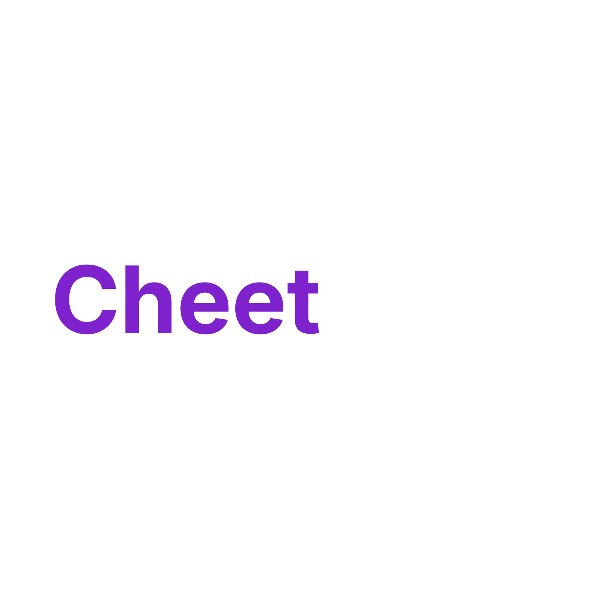

# CheetCode

## How to Start
Instructions are included inside the backend/sockets/runhost.txt

## Inspiration

Many of us have played a pretty recently trending game called Imposter and we have pretty good time playing. We wanted to bring that same energy into the world of coding. CheetCode was born from combining the thrill of Imposter with real technical skill-building — a game where reading code carefully and writing clean, readable solutions actually matters. We built it to make the grind of improving as a developer feel less like work and more like hanging out with friends.

## What it does

CheetCode is a multiplayer coding game for 5 players. Four players are given a coding prompt and must write a solution that passes hidden test cases. The fifth player — the imposter — receives no prompt at all. Their job is to study the others' code, reverse-engineer the problem, and write something convincing enough to avoid getting voted out. After the coding phase, all submissions are revealed and players vote on who they think the imposter is. The imposter wins by surviving the vote. Everyone else wins by catching them.

## How we built it

We used React for the frontend, paired with the Monaco Editor to give players a real in-browser coding experience. The backend is built in Python, with a custom server using Python's native socket library handling all real-time communication between players — room creation, game state syncing, code submissions, and voting. A code runner executes submitted solutions against a set of test cases stored in JSON files, alongside a matching database of questions. All of it is tied together through a clean client-server protocol we designed ourselves.

## Challenges we ran into

The biggest challenge was learning and implementing WebSockets from scratch. Building our own Python server and establishing a stable, real-time connection between multiple clients before anything else could work was a significant hurdle. Designing a reliable protocol for game state — handling edge cases like players disconnecting, vote synchronization, and code submission timing — required a lot of iteration and debugging we hadn't anticipated going in.

## Accomplishments that we're proud of

- Built a stable, real-time multiplayer connection supporting multiple simultaneous clients
- Designed and implemented a clean server-client protocol from the ground up
- Integrated the Monaco Editor into a seamless in-game coding experience
- Shipped a polished, fully functional web app end-to-end within the hackathon timeframe

## What we learned

- How Python's native socket library works and how to build a real-time server from scratch
- How to integrate and configure the Monaco Editor in a React app
- How to design and maintain a structured client-server protocol for a stateful multiplayer game
- The importance of establishing core infrastructure early before building features on top

## What's next for CheetCode

- **Multi-language support** — play in Python, JavaScript, Java, and more
- **Expanded question bank** with a wider variety of problems
- **Difficulty tiers** — Easy, Medium, and Hard rounds
- **Feedback system** — post-game breakdowns showing optimal solutions
- **Multiple concurrent rooms** — let anyone host a game at any time
- **UI upgrades** — animations, themes, and a more polished overall experience

## Built With

- React
- Monaco Editor
- Python
- WebSockets (native socket library)
